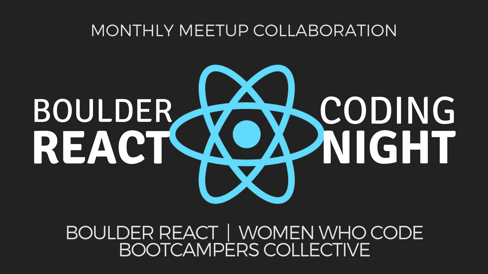

#Welcome to the first Boulder React Coding Night!

## Project Instructions
* Fork and clone the repo: https://github.com/gooWee/Boulder-React-Coding-Night
* Run `npm install`
* Run `npm start`
* Choose a game and the associated readme and begin!

## Deployment Instructions
* `npm run build`
* `npm run surge`
* You'll be prompted to create a surge account if you don't have one
* IMPORTANT: add `build` to the end of the project path
* Leave the default domain or modify the value before `.surge.sh`
* Copy the URL and visit your site!
